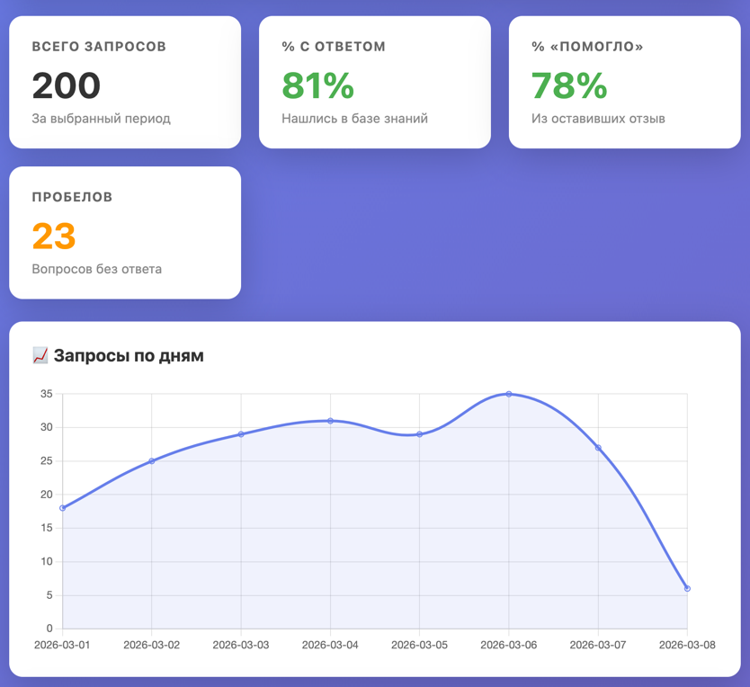

# Дашборд аналитики запросов — РТУ МИРЭА

Интерактивный дашборд для визуализации данных от Telegram FAQ-бота.

## Структура

```
analytics/
├── dashboard.html            # Интерактивный дашборд (Sprint 3)
├── knowledge_graph.html      # Граф знаний FAQ (Sprint 4)
├── generate_test_data.py     # Генератор тестовых данных
├── test_data/
│   ├── requests.jsonl        # Тестовые логи (~200 записей)
│   └── suggestions.jsonl     # Тестовые предложения (~30 записей)
└── README.md                 # Этот файл
```

## Быстрый старт

### 1. Генерация тестовых данных

```bash
cd analytics
python generate_test_data.py
```

Скрипт создаст файлы:
- `test_data/requests.jsonl` — ~200 записей логов запросов
- `test_data/suggestions.jsonl` — ~30 записей предложений пользователей

### 2. Запуск дашборда

Откройте `dashboard.html` в любом браузере (двойной клик или перетащите файл).

### 3. Загрузка данных

1. Нажмите «Выбрать файл» для **Requests** → выберите `test_data/requests.jsonl`
2. Нажмите «Выбрать файл» для **Suggestions** → выберите `test_data/suggestions.jsonl`

## Возможности дашборда

### KPI-карточки
- **Всего запросов** — общее количество запросов за период
- **% с ответом** — процент запросов, на которые бот нашёл ответ в базе
- **% «Помогло»** — процент положительных отзывов из оставивших оценку
- **Пробелов** — количество вопросов без ответа из suggestions.jsonl

### Графики
- **Запросы по дням** — линейный график активности по дням
- **Запросы по часам** — столбчатая диаграмма распределения по часам суток

### Таблицы
- **Топ-10 частых вопросов** — самые популярные вопросы с % успешных ответов
- **Статистика по категориям** — распределение по темам (экзамены, преподаватели, навигация и др.)

### Пробелы в базе знаний
Сгруппированный список вопросов, на которые бот не смог ответить.  
Похожие вопросы автоматически объединяются в кластеры по схожести текста (Jaccard ≥ 0.3):
- 🆕 Новые вопросы (type: new_question) — сгруппированы по схожести
- 💡 Предложения с ответами (type: new_answer, question_with_answer)

### Фильтр по дате
Выберите диапазон дат и нажмите «Применить» для фильтрации данных.

### Экспорт в CSV
Кнопка «📥 Экспорт в CSV» скачивает файл `recommendations.csv` со списком вопросов-кандидатов на добавление в FAQ, отсортированных по приоритету (частота × % без ответа).

## Форматы данных

### requests.jsonl
```json
{"timestamp": "2026-03-18T14:30:00", "query": "когда стипендия", "answer": "...", "matched": true, "helpful": null}
```

| Поле | Тип | Описание |
|---|---|---|
| `timestamp` | str (ISO 8601) | Время запроса |
| `query` | str | Текст вопроса |
| `answer` | str | Ответ бота |
| `matched` | bool | Нашёлся ли ответ в FAQ |
| `helpful` | bool\|null | Оценка пользователя |

### suggestions.jsonl
```json
{"timestamp": "2026-03-18T15:00:00", "user": "Иван", "type": "new_question", "question": "...", "answer": null}
```

| Поле | Тип | Описание |
|---|---|---|
| `timestamp` | str (ISO 8601) | Время предложения |
| `user` | str | Имя пользователя |
| `type` | str | `new_question`, `new_answer`, `question_with_answer` |
| `question` | str | Текст вопроса |
| `answer` | str\|null | Предлагаемый ответ |

---

## Граф знаний FAQ (Sprint 4)

Интерактивный граф базы знаний на D3.js v7. Визуализирует структуру `faq.json`: категории → вопросы.

### Запуск

Откройте `knowledge_graph.html` в браузере, нажмите «Загрузить faq.json» и выберите файл `faq.json`.

### Возможности

- **Граф** — force-directed layout: крупные цветные узлы-категории, средние серые узлы-вопросы
- **Клик на вопрос** — карточка с текстом вопроса, ответом и ключевыми словами
- **Hover** — подсветка узла и всех вопросов его категории (остальные затемняются)
- **Drag** — перетаскивание узлов мышью
- **Фильтр категорий** — кнопки в верхней панели, скрывают/показывают категорию
- **Поиск** — поле ввода подсвечивает совпадающие вопросы оранжевой обводкой
- **Легенда** — цвета категорий в левом нижнем углу
- **Zoom & pan** — колёсико мыши / тачпад

### Формат входных данных

`faq.json` — массив объектов:

```json
[
  {
    "id": 1,
    "question": "Когда пересдача по матану?",
    "keywords": ["пересдача", "матан"],
    "answer": "Пересдача 15 июня в 10:00...",
    "category": "экзамены",
    "source": "manual"
  }
]
```

---

## Проверка работы

### dashboard.html

1. ✅ `python generate_test_data.py` → создаёт файлы в `test_data/`
2. ✅ Открываю `dashboard.html` в браузере
3. ✅ Загружаю `requests.jsonl` → вижу KPI, графики, топ вопросов
4. ✅ Загружаю `suggestions.jsonl` → вижу список пробелов, сгруппированных по схожести
5. ✅ Нажимаю «Экспорт в CSV» → скачивается файл с рекомендациями

### knowledge_graph.html

1. ✅ Открываю `knowledge_graph.html` в браузере
2. ✅ Загружаю `faq.json` → появляется граф с цветными категориями и серыми вопросами
3. ✅ Кликаю на вопрос → карточка с вопросом, ответом и ключевыми словами
4. ✅ Нажимаю кнопку категории → узлы скрываются/показываются
5. ✅ Ввожу текст в поиск → совпадающие узлы подсвечиваются
6. ✅ Перетаскиваю узел — граф перестраивается

## Скриншот



## Технологии

- **HTML5 + CSS3** — тёмная тема, responsive layout
- **Chart.js** (CDN) — графики в dashboard.html
- **D3.js v7** (CDN) — force-directed граф в knowledge_graph.html
- **Vanilla JavaScript** — без зависимостей, файлы открываются напрямую в браузере
